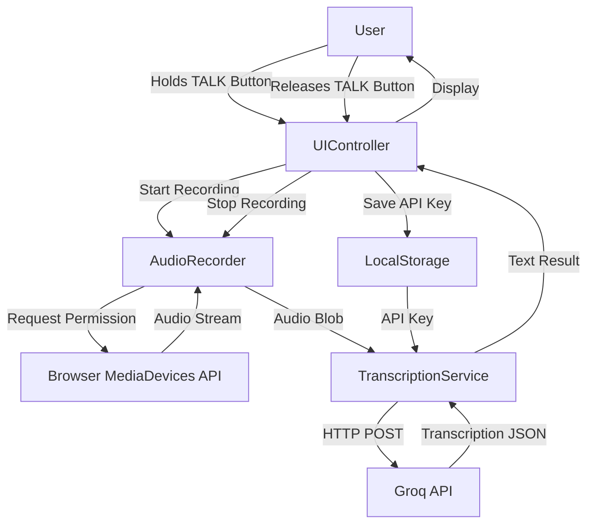

# Design Document: Speech-to-Text Web Application

## Overview

This design document describes a simple speech-to-text web application built with vanilla JavaScript, HTML, and CSS. The application captures audio from the user's microphone using the Web Audio API and MediaRecorder API, then sends it to Groq's Whisper API endpoint for transcription.

The application follows a modular architecture with three main components:
- **AudioRecorder**: Handles microphone access and audio capture
- **TranscriptionService**: Manages API communication with Groq
- **UIController**: Coordinates user interactions and display updates

The design prioritizes simplicity and browser compatibility while maintaining clear separation of concerns.

## Architecture

### System Architecture



### Component Interaction Flow

1. **Initialization**: UIController initializes and checks for stored API key in localStorage
2. **Recording Start**: User presses and holds TALK button → UIController calls AudioRecorder.start() → AudioRecorder requests microphone permission
3. **Recording Stop**: User releases TALK button → UIController calls AudioRecorder.stop() → AudioRecorder returns audio Blob
4. **Transcription**: UIController automatically passes audio Blob to TranscriptionService → Service sends to Groq API → Returns transcription text
5. **Display**: UIController updates UI with transcription result

## Components and Interfaces

### AudioRecorder Component

**Responsibilities:**
- Request and manage microphone permissions
- Capture audio using MediaRecorder API
- Convert recorded audio to appropriate format (Blob)
- Provide recording state management

**Interface:**
```javascript
class AudioRecorder {
  constructor()
  
  // Start recording audio from microphone
  // Returns: Promise<void>
  // Throws: Error if permission denied or MediaRecorder not supported
  async start()
  
  // Stop recording and return audio data
  // Returns: Promise<Blob> - audio data in webm/mp4/ogg format
  stop()
  
  // Get current recording state
  // Returns: 'inactive' | 'recording' | 'paused'
  getState()
  
  // Check if browser supports audio recording
  // Returns: boolean
  static isSupported()
}
```

**Implementation Details:**
- Uses `navigator.mediaDevices.getUserMedia()` for microphone access
- Uses `MediaRecorder` API for audio capture
- Collects audio chunks in an array during recording
- Creates Blob from chunks when stopped
- Supports common audio formats: webm (opus/vorbis), mp4, ogg

### TranscriptionService Component

**Responsibilities:**
- Send audio data to Groq API
- Handle API authentication
- Parse and return transcription results
- Manage API errors

**Interface:**
```javascript
class TranscriptionService {
  constructor(apiKey)
  
  // Send audio to Groq API for transcription
  // Parameters:
  //   audioBlob: Blob - audio data
  //   model: string - Groq model name (default: 'whisper-large-v3')
  // Returns: Promise<string> - transcribed text
  // Throws: Error with message on API failure
  async transcribe(audioBlob, model = 'whisper-large-v3')
  
  // Update API key
  setApiKey(apiKey)
}
```

**API Endpoint:**
- URL: `https://api.groq.com/openai/v1/audio/transcriptions`
- Method: POST
- Content-Type: multipart/form-data
- Authorization: Bearer {API_KEY}

**Request Format:**
```javascript
FormData {
  file: Blob (audio file)
  model: string (e.g., 'whisper-large-v3')
}
```

**Response Format:**
```json
{
  "text": "transcribed text content"
}
```

### UIController Component

**Responsibilities:**
- Manage all DOM interactions
- Coordinate AudioRecorder and TranscriptionService
- Handle user input events
- Display status messages and results
- Manage API key storage

**Interface:**
```javascript
class UIController {
  constructor()
  
  // Initialize the UI and set up event listeners
  init()
  
  // Handle TALK button press (mousedown/touchstart)
  handleTalkButtonPress()
  
  // Handle TALK button release (mouseup/touchend)
  handleTalkButtonRelease()
  
  // Handle API key submission
  handleApiKeySubmit(apiKey)
  
  // Update UI state
  updateStatus(status) // 'ready' | 'recording' | 'processing' | 'error'
  
  // Display transcription result
  displayTranscription(text)
  
  // Display error message
  displayError(message)
}
```

**DOM Structure:**
```html
<div id="app">
  <div id="api-key-section">
    <input id="api-key-input" type="password" placeholder="Enter Groq API Key">
    <button id="save-api-key-btn">Save API Key</button>
  </div>
  
  <div id="status-display">Status: Ready</div>
  
  <div id="controls">
    <button id="talk-btn" class="talk-button">TALK</button>
    <p class="instruction">Hold button to record, release to transcribe</p>
  </div>
  
  <div id="result-section">
    <h3>Transcription:</h3>
    <textarea id="transcription-output" readonly></textarea>
  </div>
  
  <div id="error-display" style="display: none;"></div>
</div>
```

## Data Models

### Audio Data

```javascript
{
  blob: Blob,           // Raw audio data
  type: string,         // MIME type (e.g., 'audio/webm')
  size: number          // Size in bytes
}
```

### API Configuration

```javascript
{
  apiKey: string,       // Groq API key
  model: string         // Model name (default: 'whisper-large-v3')
}
```

### Application State

```javascript
{
  status: 'ready' | 'recording' | 'processing' | 'error',
  hasApiKey: boolean,
  isRecording: boolean,
  lastTranscription: string | null,
  lastError: string | null
}
```

### Groq API Response

```javascript
{
  text: string          // Transcribed text from audio
}
```

### Error Response

```javascript
{
  error: {
    message: string,    // Error description
    type: string,       // Error type
    code: string        // Error code
  }
}
```


## Correctness Properties

*A property is a characteristic or behavior that should hold true across all valid executions of a system—essentially, a formal statement about what the system should do. Properties serve as the bridge between human-readable specifications and machine-verifiable correctness guarantees.*

### Property 1: Recording Initiation Flow

*For any* user interaction that triggers recording, the system should request microphone permission and, when granted, start capturing audio with MediaRecorder in the recording state.

**Validates: Requirements 1.1, 1.2**

### Property 2: Recording Stop Produces Audio Blob

*For any* recording session, when stopped, the AudioRecorder should return a valid Blob object with a supported audio MIME type and non-zero size.

**Validates: Requirements 1.3**

### Property 3: UI Reflects Application State

*For any* application state (ready, recording, processing, error), the UI should display the corresponding status and update the TALK button appearance appropriately (visual indicator while held down, disabled during processing).

**Validates: Requirements 1.6, 4.4, 4.5**

### Property 4: Transcription Service Sends Audio to API

*For any* audio Blob provided to the TranscriptionService, the service should make an HTTP POST request to the Groq API endpoint with the audio data in multipart/form-data format.

**Validates: Requirements 2.1**

### Property 5: Successful Transcription Display

*For any* successful API response containing transcribed text, the UIController should display that text in the transcription output area.

**Validates: Requirements 2.2**

### Property 6: Processing State Shows Loading Indicator

*For any* transcription request in progress, the UI should display a loading indicator and set status to 'processing' until the request completes.

**Validates: Requirements 2.4**

### Property 7: API Key Storage Round Trip

*For any* valid (non-empty) API key string, storing it via the UIController should result in the same key being retrievable from localStorage.

**Validates: Requirements 3.2**

### Property 8: Empty API Key Validation

*For any* string composed entirely of whitespace or empty string, attempting to submit it as an API key should be rejected and not stored.

**Validates: Requirements 3.3**

### Property 9: Audio Format Compatibility

*For any* audio Blob produced by AudioRecorder, its MIME type should be one of the formats supported by Groq API (audio/webm, audio/mp4, audio/ogg, audio/mpeg, audio/wav).

**Validates: Requirements 5.1**

### Property 10: API Requests Include Required Headers

*For any* transcription API request, the HTTP headers should include both the Authorization header with the Bearer token and the correct Content-Type for multipart/form-data.

**Validates: Requirements 5.2, 5.3**

## Error Handling

### Microphone Permission Errors

**Error Type:** Permission Denied
- **Trigger:** User denies microphone access or browser blocks permission
- **Handling:** 
  - Catch error from `getUserMedia()`
  - Display user-friendly message: "Microphone access denied. Please allow microphone permission to use this app."
  - Set status to 'error'
  - Keep record button enabled for retry

**Error Type:** MediaRecorder Not Supported
- **Trigger:** Browser doesn't support MediaRecorder API
- **Handling:**
  - Check `MediaRecorder.isTypeSupported()` on initialization
  - Display message: "Your browser doesn't support audio recording. Please use a modern browser."
  - Disable record button

### API Communication Errors

**Error Type:** Network Failure
- **Trigger:** No internet connection or network timeout
- **Handling:**
  - Catch fetch errors
  - Display message: "Network error. Please check your connection and try again."
  - Set status to 'error'
  - Keep transcription data for retry

**Error Type:** Authentication Failure (401)
- **Trigger:** Invalid or expired API key
- **Handling:**
  - Check response status code
  - Display message: "Invalid API key. Please check your Groq API key and try again."
  - Prompt user to re-enter API key
  - Set status to 'error'

**Error Type:** API Rate Limit (429)
- **Trigger:** Too many requests to Groq API
- **Handling:**
  - Check response status code
  - Display message: "Rate limit exceeded. Please wait a moment and try again."
  - Set status to 'error'

**Error Type:** Server Error (500+)
- **Trigger:** Groq API internal error
- **Handling:**
  - Check response status code
  - Display message: "Service temporarily unavailable. Please try again later."
  - Set status to 'error'

**Error Type:** Invalid Audio Format
- **Trigger:** Audio format not supported by API
- **Handling:**
  - Check response error message
  - Display message: "Audio format not supported. Please try recording again."
  - Set status to 'error'

### Input Validation Errors

**Error Type:** Empty API Key
- **Trigger:** User submits empty or whitespace-only API key
- **Handling:**
  - Validate input before storage
  - Display message: "Please enter a valid API key."
  - Keep input field focused

**Error Type:** No API Key Configured
- **Trigger:** User attempts to record without setting API key
- **Handling:**
  - Check localStorage on initialization
  - Disable record button
  - Display message: "Please configure your Groq API key to start recording."

### Error Recovery Strategy

1. **Graceful Degradation:** All errors should leave the app in a usable state
2. **Clear Messaging:** Error messages should be specific and actionable
3. **State Reset:** After error display, allow user to retry the operation
4. **No Data Loss:** Preserve recorded audio if transcription fails (future enhancement)

## Testing Strategy

### Overview

The testing strategy employs a dual approach combining unit tests for specific scenarios and property-based tests for comprehensive validation of universal properties. This ensures both concrete edge cases and general correctness are verified.

### Property-Based Testing

**Framework:** fast-check (JavaScript property-based testing library)

**Configuration:**
- Minimum 100 iterations per property test
- Each test tagged with feature name and property reference
- Tag format: `Feature: speech-to-text-app, Property {number}: {property_text}`

**Property Test Implementation:**

Each correctness property from the design document will be implemented as a single property-based test:

1. **Property 1 Test:** Generate random permission states and verify recording flow
2. **Property 2 Test:** Generate recordings of various durations and verify Blob validity
3. **Property 3 Test:** Generate all possible application states and verify UI consistency
4. **Property 4 Test:** Generate random audio Blobs and verify API call structure
5. **Property 5 Test:** Generate random transcription texts and verify display
6. **Property 6 Test:** Generate async operations and verify loading indicator presence
7. **Property 7 Test:** Generate random API key strings and verify storage round-trip
8. **Property 8 Test:** Generate whitespace/empty strings and verify rejection
9. **Property 9 Test:** Generate audio Blobs and verify MIME type compatibility
10. **Property 10 Test:** Generate API requests and verify header presence

### Unit Testing

**Framework:** Jest or Vitest (for vanilla JavaScript)

**Focus Areas:**

1. **Example Tests:**
   - Required UI elements are present (buttons, input fields, text areas)
   - Initial state when no API key is configured
   - Specific error messages for known failure scenarios

2. **Edge Cases:**
   - Microphone permission denied scenario
   - API request failure scenarios (401, 429, 500)
   - Empty audio recording (0 duration)
   - Very long recordings (>5 minutes)
   - Special characters in transcription output

3. **Integration Points:**
   - AudioRecorder → UIController communication
   - TranscriptionService → UIController communication
   - localStorage persistence across page reloads
   - Browser API mocking (getUserMedia, MediaRecorder)

4. **Error Conditions:**
   - Network timeout handling
   - Invalid API response format
   - Browser API unavailability
   - Concurrent recording attempts

### Test Organization

```
tests/
├── unit/
│   ├── AudioRecorder.test.js
│   ├── TranscriptionService.test.js
│   ├── UIController.test.js
│   └── integration.test.js
└── property/
    ├── recording.property.test.js
    ├── transcription.property.test.js
    ├── storage.property.test.js
    └── api.property.test.js
```

### Mocking Strategy

- **Browser APIs:** Mock `navigator.mediaDevices.getUserMedia()` and `MediaRecorder`
- **Fetch API:** Mock `fetch()` for Groq API calls
- **localStorage:** Mock or use in-memory implementation
- **DOM:** Use jsdom or similar for DOM testing

### Coverage Goals

- **Unit Test Coverage:** Focus on specific examples and edge cases, not exhaustive input coverage
- **Property Test Coverage:** 100% of correctness properties implemented
- **Integration Coverage:** All component interactions tested
- **Error Path Coverage:** All error handling paths verified

### Testing Balance

Unit tests provide concrete examples and catch specific bugs, while property tests verify general correctness across many inputs. Together, they ensure the application behaves correctly in both expected and unexpected scenarios. Avoid writing excessive unit tests for input variations—property tests handle comprehensive input coverage efficiently.
